# Spring Boot OAuth2/OIDC POC with Keycloak & GitHub

This project implements a secure, production-ready authentication architecture using the **BFF (Backend for Frontend)** pattern. It demonstrates how to secure a distributed system using industry-standard protocols (OAuth2/OIDC) without exposing sensitive tokens to the browser.

## 🧠 Core Concepts

### What is OAuth 2.0?
**"The Authorization Protocol"**
Think of OAuth 2.0 as giving a valet key to your car. The valet key allows someone (the application) to start and drive your car (access your data) without having your full set of keys (your password).
*   **In this project**: It is used to allow the BFF service to access the Resource Server on behalf of the user.

### What is OIDC (OpenID Connect)?
**"The Authentication Protocol"**
OIDC sits on top of OAuth 2.0 and adds the identity layer. While OAuth is about "access", OIDC is about "who are you?". It provides a standard way to verify the user's identity and get basic profile information.
*   **In this project**: Keycloak uses OIDC to verify your identity involves GitHub and provides your user details (name, email) to the BFF.

### What is BFF (Backend for Frontend)?
**"The Secure Proxy"**
A pattern where a dedicated backend service is created for a specific frontend. In modern security, it acts as a secure intermediary that handles all complex authentication flows server-side.
*   **In this project**: instead of the browser holding sensitive tokens (which is unsafe), the **BFF** holds them. The browser just establishes a secure session (Cookie) with the BFF. When the browser needs data, it asks the BFF, and the BFF uses the stored token to call the API.

---

```mermaid
flowchart TD
    Browser["🌐 Browser"]
    BFF["🛡 BFF Service<br/>(Spring Boot)"]
    Resource["🔐 Resource Service<br/>(JWT Protected)"]
    Keycloak["🧩 Keycloak<br/>(OIDC Provider)"]
    GitHub["🐙 GitHub OAuth"]

    Browser -->|HTTP-only Session Cookie| BFF
    BFF -->|Bearer Token| Resource
    Resource --> Keycloak
    Keycloak --> GitHub
```

## 🏗 Architecture Overview

The system consists of three main components:

### 1. Keycloak (Authentication Server)
- Acts as the central **Identity Provider (IdP)**.
- Brokers authentication to **GitHub** (External IdP).
- Issues and manages access tokens (JWTs).
- Running in a Docker container.

### 2. BFF Service (Backend for Frontend)
- **Role**: OAuth2 Client.
- **Technology**: Spring Boot + Spring Security `oauth2-client`.
- **Responsibilities**:
    - Handles the OAuth2 Authorization Code Flow.
    - Stores tokens securely in the server-side session (not in the browser).
    - Maintains a session with the user's browser via HTTP-Only cookies.
    - Acts as a proxy: Receives requests from the browser, attaches the JWT (Access Token), and forwards the request to the Resource Server.

### 3. Resource Service (API)
- **Role**: OAuth2 Resource Server.
- **Technology**: Spring Boot + Spring Security `oauth2-resource-server`.
- **Responsibilities**:
    - Stateless API.
    - Accepts requests *only* with a valid Bearer Token (JWT).
    - Validates the JWT signature against Keycloak's public keys (JWK Set).
    - Authorization (Role/Scope based checks).

---

## 🔐 Concepts & Flow

### Why this pattern?
Traditional Single Page Applications (SPAs) often store tokens in LocalStorage, which is vulnerable to XSS attacks. The **BFF Pattern** mitigates this by keeping tokens on the server. The browser only holds an encrypted session cookie, which is strictly coupled to the BFF domain.

### Authentication Flow
1.  **User Visits BFF**: User requests `/api/me`.
2.  **Redirect to Login**: BFF sees the user is unauthenticated and redirects to Keycloak.
3.  **GitHub Login**: Keycloak delegates login to GitHub. User logs in at GitHub.
4.  **Code Exchange**: GitHub returns a code to Keycloak -> Keycloak returns a code to BFF.
5.  **Token Retrieval**: BFF exchanges the code for an Access Token & Refresh Token from Keycloak (Back-channel communication).
6.  **Session Created**: BFF creates a session and sets a `JSESSIONID` cookie in the browser.
7.  **Proxying**: When the browser asks for data, the BFF looks up the token from the session, adds `Authorization: Bearer <token>`, and calls the Resource Server.

---

## 📂 Project Structure

### `bff-service`
- **`config/`**: Security and WebClient configuration.
    - `SecurityConfig.java`: Configures OAuth2 Login and Logout.
    - `WebClientConfig.java`: Configures the Token Relay mechanism (auto-attaching tokens).
- **`controller/`**: Endpoints (e.g., `/api/me`) that proxy requests to the backend.

### `resource-service`
- **`config/`**: Security configuration.
    - `SecurityConfig.java`: Configures JWT validation and Stateless session policy.
- **`controller/`**: Protected API endpoints.

---

## 🚀 Getting Started

- Please refer to [RUNNING.md](./RUNNING.md) for detailed instructions on how to set up and run this project.
- Please refer to [KEYCLOAK_SETUP.md](./KEYCLOAK_SETUP.md) for detailed instructions on how to set up KEYCLOCK.[Important]
